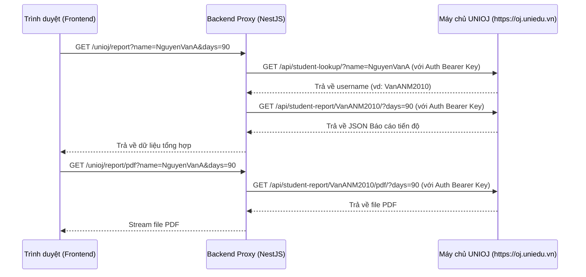

# Tài liệu tích hợp API UNIOJ (Online Judge)

Tài liệu này mô tả chi tiết tích hợp hệ thống chấm bài UNIOJ vào trang quản lý học tập cá nhân của học sinh tại `/student`.

## 1. Luồng hoạt động & Bảo mật

Để bảo mật khóa `api_key` của UNIOJ (không lộ ra trình duyệt phía client), hệ thống sử dụng mô hình **Proxy Server** tại backend NestJS (`apps/api`).

## 2. API Endpoints tại Backend (`apps/api`)

Cấu hình env:
- `UNIOJ_API_KEY`: API Key lấy từ hồ sơ Profile UNIOJ (Base64url key).
- `UNIOJ_BASE_URL`: Mặc định `https://oj.uniedu.vn`. Giá trị này phải là origin của OJ, không phải URL backend Unicorns. Nếu cấu hình nhầm về `localhost`/API local, backend sẽ bỏ qua và dùng `https://oj.uniedu.vn`.

### 2.1 Lấy JSON dữ liệu tiến độ học tập
- **Endpoint**: `GET /unioj/report`
- **Quyền**: `admin`, `staff`, `student` (Cookie `access_token` hợp lệ).
- **Tham số**:
  - `name` (Bắt buộc): Tên đầy đủ học sinh.
  - `days` (Không bắt buộc): Khoảng thời gian thống kê (7–365 ngày). Mặc định 90 ngày.
- **Phản hồi (200 OK)**:
  JSON chứa dữ liệu bao gồm:
  - `stats`: Điểm số, số bài giải, tỉ lệ AC, level hiện tại.
  - `dailyProgress`: Lịch sử giải bài theo ngày.
  - `roadmapLevels`: Thống kê các level trong lộ trình.
  - `roadmapModules`: Chi tiết các module trong từng level.

### 2.2 Tải & Xem PDF Báo cáo chi tiết cho phụ huynh
- **Endpoint**: `GET /unioj/report/pdf`
- **Quyền**: `admin`, `staff`, `student` (Cookie `access_token` hợp lệ).
- **Tham số**:
  - `name` (Bắt buộc): Tên đầy đủ học sinh.
  - `days` (Không bắt buộc): Khoảng thời gian thống kê.
- **Phản hồi**:
  File PDF (`application/pdf`). Frontend gọi endpoint này bằng shared Axios client với `responseType: "blob"`, nhận file qua backend proxy, tạo object URL nội bộ của trình duyệt rồi mới preview/download. Trình duyệt không nhúng trực tiếp `https://oj.uniedu.vn`, nên không bị chặn bởi `X-Frame-Options: deny` của OJ.
- **Lưu ý upstream**: nếu UNIOJ trả `503` với message `pdf rendering is not available on this site`, site OJ hiện không bật renderer PDF. Khi đó backend không thể proxy PDF từ OJ; cần yêu cầu OJ bật renderer hoặc bổ sung luồng tự render PDF từ JSON báo cáo trong backend Unicorns.

## 3. Giao diện Frontend (`apps/web`)

Thêm block **"Tiến độ học tập Online Judge (UNIOJ)"** sử dụng component [OjProgressSection.tsx](file:///Users/sunny/workspace/UnicornsEduWeb5./apps/web/components/student/OjProgressSection.tsx) ở cuối:
1. Trang học tập cá nhân của học sinh: `/student/page.tsx`
2. Trang chi tiết học sinh của admin và staff: `/admin/students/[id]/page.tsx` (và mirror `/staff/students/[id]/page.tsx`).

Các tính năng chính:
1. **Bộ lọc thời gian**: Chọn 30 / 60 / 90 / 180 / 365 ngày.
2. **Biểu đồ tiến độ (Recharts)**: Biểu đồ kết hợp cột (Mới mỗi ngày) và đường (Tổng đã giải) trực quan.
3. **Circular Progress (Lộ trình)**: Hiển thị tỉ lệ % hoàn thành từng level bằng thư viện `react-circular-progressbar`.
4. **Chi tiết Modules**: Cho phép bấm "Modules" trên từng level để xem bảng thống kê tiến độ chi tiết của các module con thuộc level đó (như Đệ quy, Mảng, Greedy, ...).
5. **PDF Báo cáo**: Tải file PDF qua backend proxy rồi preview bằng blob URL nội bộ:
   - Frontend gọi `GET /unioj/report/pdf?name=&days=` bằng shared Axios client (`responseType: "blob"`).
   - Không nhúng hoặc mở trực tiếp URL OJ trong iframe/window.
   - *Tải PDF*: tạo link download từ blob đã tải về.
   - *In / Lưu PDF*: mở blob URL ở tab mới để dùng trình xem PDF của trình duyệt.
   - *Mở rộng / Fullscreen*: hiển thị cùng blob URL trong modal phủ toàn màn hình.
6. **Dữ liệu Demo (Mock)**: Nếu học sinh chưa có tài khoản đồng bộ trên UNIOJ (API lookup trả về 404), giao diện hiển thị trạng thái "Chưa có dữ liệu OJ" và cung cấp tuỳ chọn "Xem dữ liệu mẫu (Demo)" để dễ dàng xem thử tính năng.
